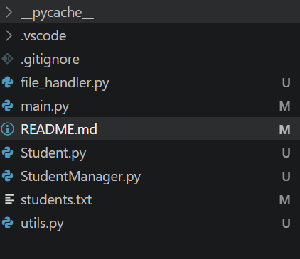
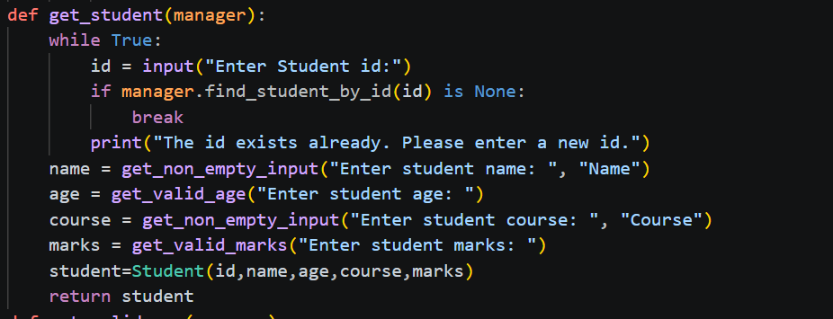
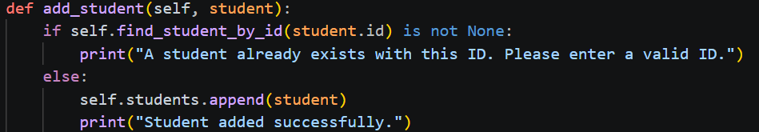
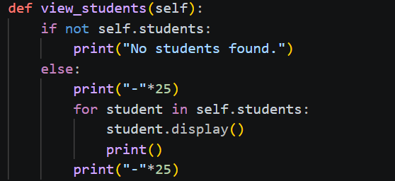
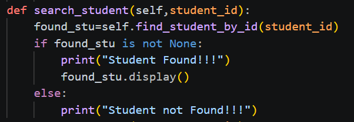
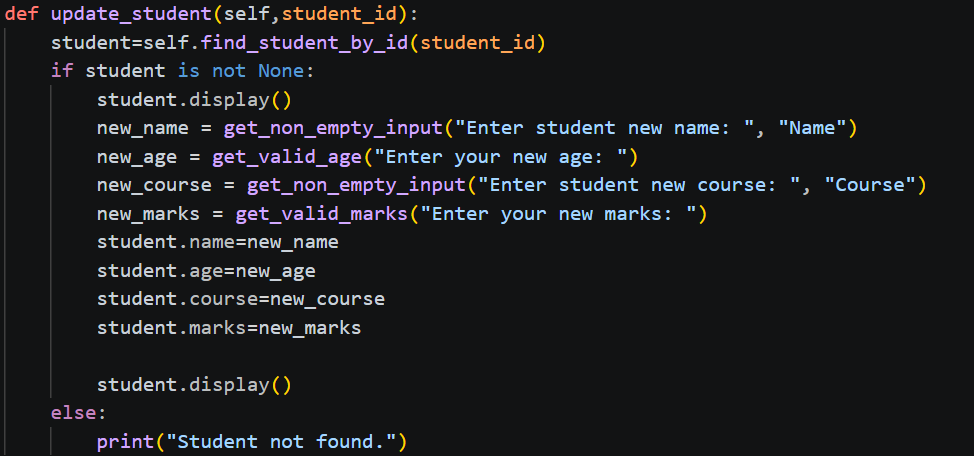
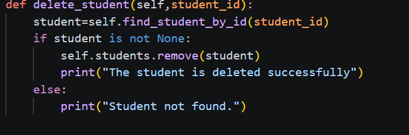

# 🎓 Student Management System

A console-based **Student Management System** developed in **Python** using **Object-Oriented Programming (OOP)** principles. This project allows users to manage student records efficiently through a menu-driven interface with persistent file storage.

---

## 📌 Features

- ➕ Add a new student
- 📋 View all students
- 🔍 Search a student by ID
- ✏️ Update student details
- ❌ Delete a student
- 💾 Save student records to a text file
- 📂 Automatically load existing records when the application starts
- 🚪 Save and Exit option

---

## 🛠 Technologies Used

- Python 3
- Object-Oriented Programming (Classes & Objects)
- File Handling
- Exception Handling
- Modular Programming
- Input Validation

---

## 📂 Project Structure

```
Student-Management-System/
│
├── main.py              # User interaction and menu
├── Student.py           # Student class
├── StudentManager.py    # Student management operations
├── file_handler.py      # Load and save student data
├── utils.py             # Input validation helper functions
├── students.txt         # Stores student records
└── README.md
```

---

## 📖 Functionalities

### 1. Add Student

- Accepts student details from the user.
- Prevents duplicate Student IDs.
- Validates:
  - Age must be a positive integer.
  - Marks must be between **0 and 100**.
  - Name and Course cannot be empty.


---

### 2. View Students

Displays all student records stored in memory.

---

### 3. Search Student

Searches a student using the Student ID.

---

### 4. Update Student

Allows updating:

- Name
- Age
- Course
- Marks

Includes validation for numeric fields.

---

### 5. Delete Student

Deletes a student using the Student ID.

---

### 6. Save Students

Writes all student records to **students.txt**.

---

### 7. Save and Exit

Saves the latest data before exiting the application.

---

## ✅ Input Validation

The project validates:

- Menu choice
- Student ID uniqueness
- Positive age
- Marks range (0–100)
- Empty name
- Empty course

Invalid inputs are handled using **try-except** blocks without crashing the program.

---

## 📁 Data Storage

Student records are stored in a text file.

Example:

```
1,Rama,20,Maths,90
2,Sita,19,English,95
3,Lucky,20,Hindi,70
```

The application automatically loads these records when it starts.

---

## 💡 Concepts Demonstrated

- Classes and Objects
- Constructors
- Instance Variables
- Methods
- Lists of Objects
- Encapsulation
- File Handling
- Exception Handling
- Modular Design
- Input Validation
- Search Algorithms
- CRUD Operations
- Separation of Responsibilities (Single Responsibility Principle)

---

## 🚀 How to Run

Clone the repository:

```bash
git clone https://github.com/aiswaryathavva/student-management-system

```

Go to the project directory:

```bash
cd student-management-system
```

Run the application:

```bash
python main.py
```

---

## 📷 Sample Menu

```
========== Student Management ==========

1. Add Student
2. View Students
3. Search Student
4. Update Student
5. Delete Student
6. Save Students
7. Save and Exit
```

---

## 🔮 Future Improvements

Possible enhancements:

- Store data using CSV or JSON files
- Use SQLite database
- Add login authentication
- Generate student reports
- Sort students by marks or name
- Filter students by course
- Build a GUI using Tkinter or PyQt
- Develop a web version using Flask or Django

---

## 👨‍💻 Author

**Aiswarya Thavva**

Python Developer | Learning Object-Oriented Programming & Backend Development

GitHub: https://github.com/aiswaryathavva